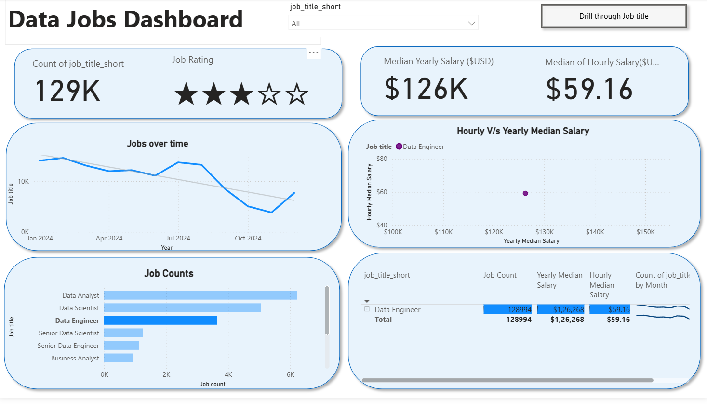

# 📊 Data Jobs Dashboard with Power BI

A Power BI dashboard designed to explore the data job market through job counts, salaries, job trends, work-from-home opportunities, employment types, hiring platforms, and global job locations.

---

## 📌 Project Overview

This dashboard was created to help **Job Seekers, Job Transitioners, and Data Professionals** understand the data job market through an interactive and easy-to-use interface.

Using a dataset of **2024 data science and analytics job postings**, the dashboard allows users to explore:

- Job demand and job counts
- Median yearly and hourly salaries
- Job trends over time
- Salary comparison across job titles
- Work-from-home opportunities
- Jobs that do not mention a degree requirement
- Health insurance availability
- Hiring platforms
- Employment types
- Global distribution of jobs

The dashboard also includes an interactive **Job Title slicer** and a **Drill Through** feature that allows users to move from the overall job market view to a detailed analysis of an individual job title.

---

## 🖼️ Dashboard Preview

### Page 1 — Data Jobs Market Overview

The first page provides a high-level overview of the data job market.

It includes:

- Total job count
- Job rating
- Median yearly salary
- Median hourly salary
- Jobs over time
- Hourly vs. yearly median salary comparison
- Job counts by job title
- Detailed job title salary table
- Job title slicer
- Drill Through button

---

### Page 2 — Job Title Drill Through

The second page provides a detailed analysis for a selected job title.

The Drill Through page includes:

- Yearly salary range
- Hourly salary range
- Work-from-home percentage
- No-degree-mention percentage
- Health insurance percentage
- Global job distribution
- Hiring platforms
- Employment/job type distribution

Users can select a specific job title from the main dashboard and drill through to this detailed view.

---

## 🎯 Key Features

### 🔹 Interactive Job Title Filter

The dashboard includes a **Job Title slicer** that allows users to filter the entire report according to a selected job title.

This makes it possible to compare the job market for different roles such as:

- Data Analyst
- Data Scientist
- Data Engineer
- Senior Data Scientist
- Senior Data Engineer
- Business Analyst
- Machine Learning Engineer
- And other data-related roles

---

### 🔹 Drill Through Analysis

The dashboard uses **Power BI Drill Through** to navigate from the high-level dashboard to a detailed job-title analysis.

For example, selecting **Business Analyst** allows the user to view information specifically related to that role.

This provides a more contextual analysis without overcrowding the main dashboard.

---

### 🔹 Salary Analysis

The dashboard presents both:

- **Median Yearly Salary**
- **Median Hourly Salary**

It also includes an **Hourly vs. Yearly Median Salary** visualization to compare compensation across different job titles.

---

### 🔹 Job Market Trends

The **Jobs Over Time** line chart shows how the number of job postings changes throughout the year.

This provides a quick view of changes in job demand over time.

---

### 🔹 Job Count Analysis

The **Job Counts** bar chart compares the number of postings across different job titles.

This makes it easier to identify roles with higher demand in the dataset.

---

### 🔹 Global Job Distribution

The Drill Through page contains a map showing where data jobs are located globally.

This provides a geographical perspective of the job market.

---

### 🔹 Work-from-Home Analysis

The dashboard shows the percentage of jobs that offer or mention **work-from-home opportunities**.

This can help job seekers understand the availability of remote work across different roles.

---

### 🔹 Degree Requirement Analysis

The dashboard includes the percentage of job postings that **do not mention a degree requirement**.

This provides an additional perspective for people transitioning into data careers.

---

### 🔹 Health Insurance Analysis

The dashboard displays the percentage of job postings mentioning **health insurance**, providing another dimension for evaluating job opportunities.

---

### 🔹 Hiring Platform Analysis

The Drill Through page identifies the platforms through which jobs are posted, including platforms such as:

- LinkedIn
- BeBee
- Indeed
- ZipRecruiter
- Jooble
- Trabaj.org
- Jobgether
- Recruit.net
- GrabJobs

---

## 🛠️ Skills & Power BI Features Demonstrated

This project demonstrates practical use of several Power BI and data analytics concepts.

### ⚙️ Data Transformation

- Power Query
- Data cleaning
- Data type transformation
- Handling missing or blank values
- Data preparation for analysis
- Creating calculated columns

### 📊 Data Visualization

- Bar charts
- Line charts
- Scatter charts
- Donut charts
- Gauge charts
- Maps
- Tables
- KPI cards

### 🖱️ Interactive Reporting

- Slicers
- Buttons
- Drill Through
- Interactive filtering
- Dashboard navigation

### 📈 Data Analysis

- Job count analysis
- Salary analysis
- Median salary calculations
- Trend analysis
- Geographic analysis
- Employment type analysis
- Work-from-home analysis

---

## 📂 Dashboard File

The Power BI project file is available here:

`Data_Jobs_Dashboard.pbix`

---

## 💡 Key Questions Explored

The dashboard was designed to answer questions such as:

1. How many data-related jobs are available?
2. Which job titles have the highest number of postings?
3. What is the median yearly salary?
4. What is the median hourly salary?
5. How does salary vary between different job titles?
6. How does the number of jobs change over time?
7. Where are data jobs located globally?
8. Which hiring platforms have the most job postings?
9. What percentage of jobs offer work-from-home opportunities?
10. What percentage of jobs do not mention a degree requirement?
11. What percentage of jobs mention health insurance?
12. What types of employment are available?

---

## 📌 Project Purpose

The purpose of this project was to transform raw job-posting data into an interactive Power BI dashboard that can help users understand the data job market and explore career-related insights.

The combination of **KPIs, charts, tables, maps, slicers, and Drill Through functionality** allows users to move from a high-level market overview to detailed job-title analysis.

---

## 🚀 Conclusion

This project demonstrates how **Power BI can transform raw job-posting data into an interactive analytical dashboard**.

The dashboard combines data transformation, visualization, filtering, salary analysis, geographic analysis, and interactive navigation to provide a comprehensive view of the data job market.

It also demonstrates practical Power BI skills that can be applied to real-world **Data Analytics and Business Intelligence** projects.

---

